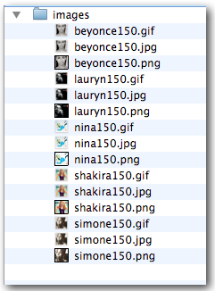
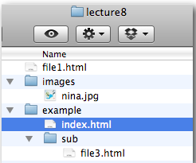

#Programmering för webben

##Föreläsning 7

###Dagens innehåll

- Filhantering 

 
###Filhantering

Funktionen `scandir` listar alla filer och kataloger i en katalog och sparar dem i en array. 

Exempel: mappen images innehåller följande filer. 

PHP-kod för att spara filnamn i en array $files och sedan skriva ut dem blir:


$files=scandir("images"); //$files blir en array med alla filnamn i mappen images
foreach ($files as $file) { 
    echo $file;
    echo " ";
}


###Sökvägar

För att öppna en fil som ligger i annan katalog måste man ange sökväg

Antag att vi har en mapp som innehåller filen *file1.html* samt mapparna *images* och *example*.
*images* innehåller filen *nina.jpg*. *example* innehåller filen *index.html* samt mappen *sub*. *sub* innehåller i sin tur filen *file3.html*.

**Exempel** Utgå från filen *index.html*. Antag att vi i den filen vill referera till andra filer eller mappar.

För att referera till file3.html anger vi 

`sub/file3.html`

För att referera till file1.html anger vi

`../file1.html`

(..betyder att vi går upp ett steg i katalogstrukturen)

För att referera till *nina.jpg* anger vi

`../images/nina.jpg`
 

**Exempel** Utgå istället från filen *file3.html*. Antag att vi i den filen vill referera till andra filer eller mappar.

För att referera till *index.html* anger vi

`../index.html`

För att referera till *file1.html* anger vi

`../../file1.html`

(../.. betyder att vi går upp två steg i katalogstrukturen)

För att referera till *nina.jpg* anger vi

`../../images/nina.jpg` 

**Exempel** Utgå från filen *file1.html*. Antag att vi i den filen vill referera till andra filer eller mappar.

För att referera till *index.html* anger vi

example/index.html`

För att referera till *file3.html* anger vi

`example/sub/file3.html`

För att referera till *nina.jpg* anger vi

`images/nina.jpg`
 
###Läsa in filer

Funktionen file_get_contents` kan användas för att läsa in godtycklig fil i en php-variabel.

**Exempel**


$str=file_get_contents("text.txt"); //$str innehåller nu texten från filen text.txt

 
###Kopiera, ta bort filer mm

Följande funktioner är användbara för att hantera filer:

- `file_exists` - kontrollerar om en fil finns
- copy - kopierar fil
- `unlink - raderar fil
- file_put_contents` - sparar data i en fil
 
###Radbrytningar i textfiler

Filer kan innehålla ett antal osynliga tecken som tex radbrytningar.

I slutet av varje rad i textfilen finns ett osynligt radbrytningstecken (ibland två osynliga tecken)

Olika datorsystem använder olika tecken för radbrytning: 

- Mac och Linux: `\n` 
- PC: `\r\n`
- Äldre Mac: `\r`
 
###Dela upp rader i en fil

Strängfunktionen `explode` är användbar vid filhantering. Grundfunktionen är att den delar upp en sträng och lägger in delarna i en array. Man bestämmer att uppdelningen ska ske vid ett visst tecken. 

**Exempel**


$string="adam,bertil,cesar,david";
$arr=explode("," ,$string); //dela upp $string vid komma-tecken


Resultat:

$arr blir en array där `$arr[0]="adam"`, `$arr[1]="bertil"`, `$arr[2]="cesar"` och `$arr[3]="david"`
 
Funktionen `explode` kan användas för att dela upp raderna i en fil så att varje rad blir ett element i en array.

**Exempel**


$file=file_get_contents("text.txt");
$rows=explode("\n",$file);


Resultat:

`$row` blir en array där `$rows[0]="Shakira"`, `$rows[1]="Beyoncé"` och `$rows[2]="Rihanna"`
 
###Array, repetition

Värden i en array kan tilldelas på följande sätt:


$drawer = array("nyckel","telefon","passagekort");
 

Värden kan hämtas på följande sätt:


echo $drawer[0]; //skriver ut nyckel
echo $drawer[1]; //skriver ut telefon
echo $drawer[2]; //skriver ut passagekort
 
 
Värden kan läggas till i en befintlig array:


$drawer[3] = "plånbok";
 

Här skapas ett fjärde element (med index = 3) med innehållet plånbok. 
Man kan även utelämna index för att lägga till ett element i slutet:


$drawer[] = "klocka";
 

Här skapas ett femte element (om det redan fanns fyra) med innehållet klocka.


echo $drawer[3]; //skriver ut plånbok echo $drawer[4]; //skriver ut klocka
 

Variabler kan användas som index:


$i = 4;
echo $drawer[$i]; //skriver ut klocka
 
 
##For-loop, repetition


for (startvärde; villkor; ändra värde på räknare)
{
    kod som upprepas
}



foreach ($arrayvariabel as $variabel)
{
    kod som upprepas. För varje varv innehåller 
    $variabel de olika elementen från $arrayvariabel i 
    tur och ordning
}


**Exempel**


for ($i=1; $i<=3; ++$i)
{
echo "$i ";
}
 

Resultat:

`1 2 3`

skrivs ut.

**Exempel**

Gå igenom en array med en loop:


$names=array('Adam','Bertil','Cesar');
for ($i=0;$i<count($names);$i++) {
    echo $names[$i];
    echo " ";
}


Resultat:


Adam
Bertil
Cesar


skrivs ut.

**Exempel**

Samma sak med foreach:


$names=array('Adam','Bertil','Cesar');
foreach ($names as $name) {
    echo $name;
    echo " ";
}


Resultat:


Adam
Bertil
Cesar


skrivs ut.
 
